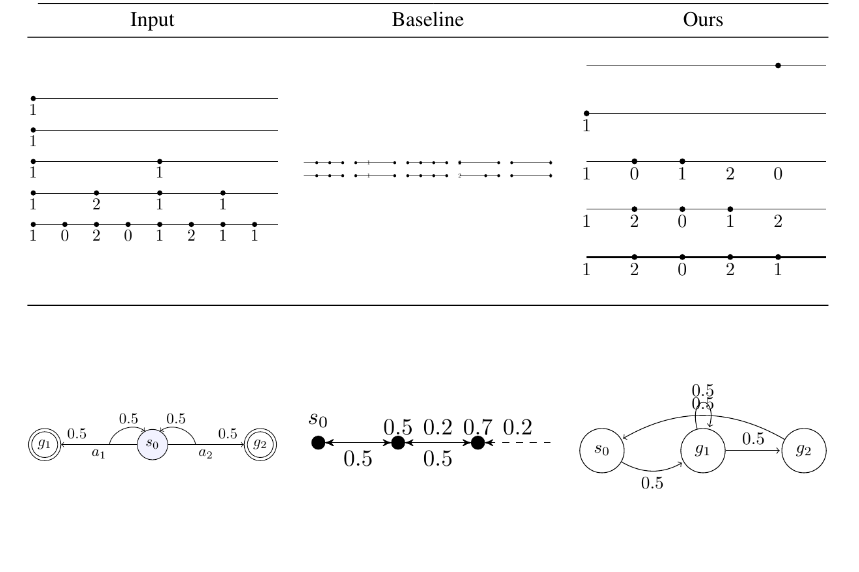

# TikZGen

TikZGen is an advanced tool for converting scientific figures into TikZ code, building upon DeTikZify. It utilizes curriculum learning with DeepSeek (1.3B) and SigLIP vision encoder to generate high-quality, editable TikZ representations of complex scientific figures.

<div align="center">
  
</div>

## Key Features

- **Figure Decomposition**: Automatically breaks down complex figures into manageable components
- **Curriculum Learning**: Uses a teacher-student framework for progressive learning
- **Enhanced Dataset**: Includes MicroTikZ, an extended dataset with sequential drawing steps
- **Comprehensive Analysis**: Employs advanced metrics for figure complexity measurement

## Prerequisites

- Python 3.11+
- Conda package manager
- Basic build tools (make, gcc, cmake)

## Installation Guide
### 1. Clone the repo: 
```bash
git clone https://github.com/potamides/DeTikZify
```
### 2. Create and Activate Conda Environment
Either create a new environment using environment.yml:
```bash
conda env create -f environment.yml
conda activate Detikzify
```
or create manually:
```bash
conda create --name Detikzify python=3.11
```
### 3. Install TeX Live
Unix/Linux Systems:
```bash
cd /tmp
wget https://mirror.ctan.org/systems/texlive/tlnet/install-tl-unx.tar.gz
zcat < install-tl-unx.tar.gz | tar xf -
cd install-tl-*
perl ./install-tl --no-interaction
Add to your PATH (add to ~/.bashrc)
export PATH=/usr/local/texlive/2024/bin/x86_64-linux:$PATH
```

Windows Users
Download and run the installer from https://mirror.ctan.org/systems/texlive/tlnet/install-tl-windows.exe

### 4. Install Ghostscript
Unix/Linux Systems
```bash
# Download AGPL release from https://www.ghostscript.com/releases/gsdnld.html
tar xzf ghostscript-10.04.0.tar.gz
cd ghostscript-10.04.0
./configure --prefix=$HOME/.local
make
make install
```
Windows Users
Download and install the appropriate Windows version from https://www.ghostscript.com/releases/gsdnld.html

### 5. Install Poppler
```bash
wget https://poppler.freedesktop.org/poppler-data-0.4.12.tar.gz
tar xzf poppler-data-0.4.12.tar.gz
cd poppler-data-0.4.12
make prefix=$HOME/.local install
cd ..
mkdir build && cd build
cmake .. -DCMAKE_INSTALL_PREFIX=$HOME/.local
make
make install
```
### if manual environment:
```bash
conda install -c conda-forge pymupdf=1.18.19
pip install -r requirements.txt
```

## 


